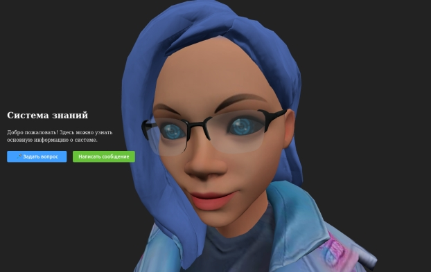

# Визуальный голосовой ассистент

Проект для работы с текстовыми и голосовыми запросами.
Бэкенд реализован на **FastAPI**, фронтенд — на **Vue 3 + TS + Element Plus**.
Используется интеграция с **Yandex Cloud ML** для генерации аудиоответов.



---

## Структура проекта
.
├── backend/ # FastAPI сервер
│ ├── main.py
│ ├── requirements.txt
│ └── .env
└── frontend/ # Vue 3 + Element Plus клиент
  ├── src/
  ├── package.json
  └── vite.config.ts

## Установка и запуск

### 1. Бэкенд

```bash
cd backend
python3 -m venv venv
source venv/bin/activate
pip install -r requirements.txt
```

Создать файл .env:

```ini
YCloudML_FOLDER_ID=<folder_id>
YCloudML_AUTH_TOKEN=<auth_token>
```

Запуск сервера:
```bash
uvicorn main:app --reload --host 0.0.0.0 --port 8000
```

### 2. Фронтенд

```bash
cd frontend
npm install
npm run dev
```

По умолчанию запускается на http://localhost:3000/.


